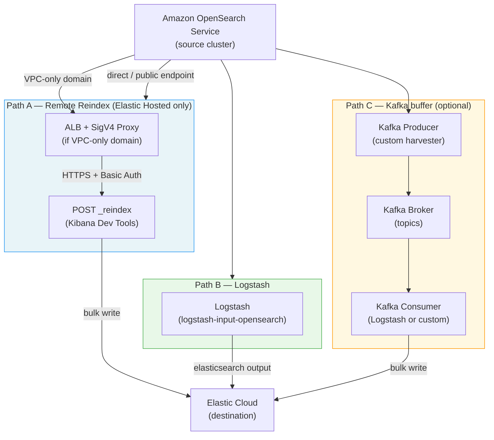
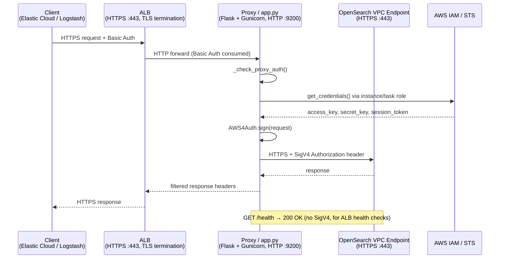
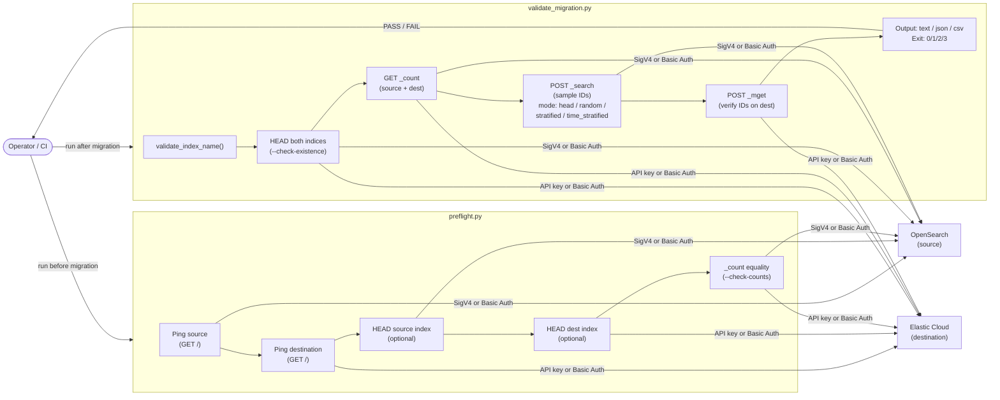
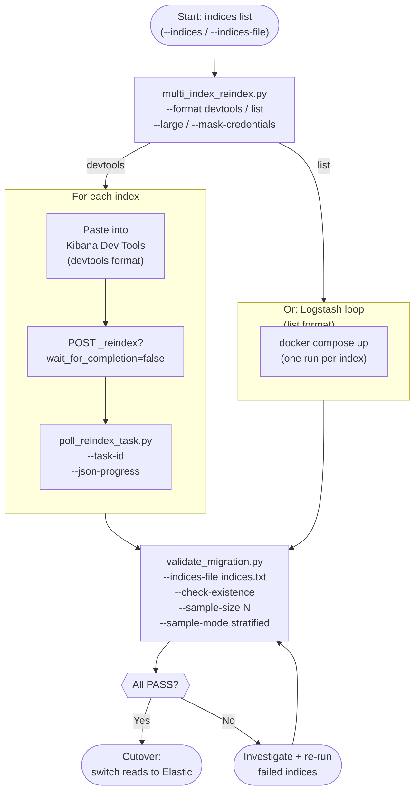
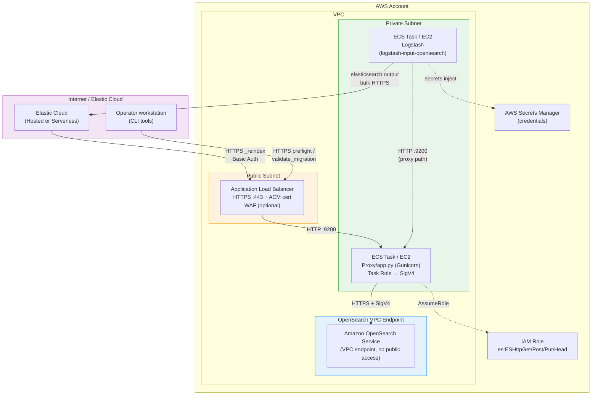
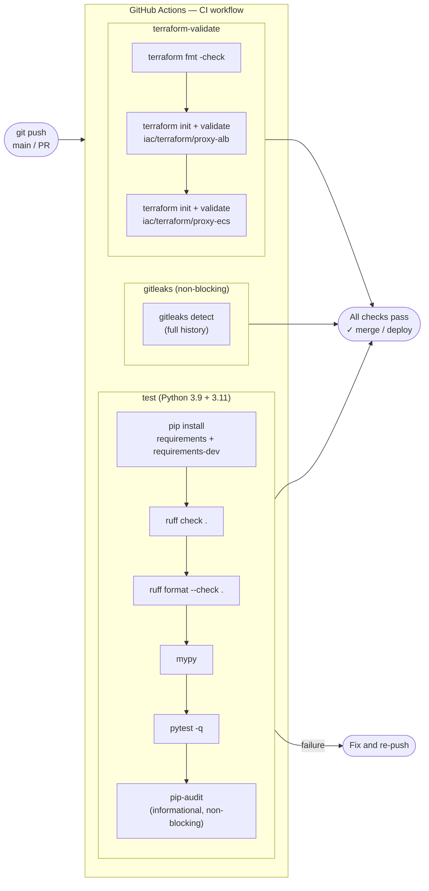

# Architecture and process flow diagrams

These diagrams illustrate the major capabilities of the toolkit. All diagrams use [Mermaid](https://mermaid.js.org/) and render natively on GitHub.

---

## 1. Migration path overview

High-level choice map: which data path to use and what components are involved.

---

## 2. VPC proxy — request flow

Used when the OpenSearch domain has no public endpoint. The proxy runs inside AWS, signs requests with SigV4, and forwards them.

---

## 3. Validation and preflight — tool flow

How `preflight.py` and `validate_migration.py` interact with both clusters.

---

## 4. Multi-index batch migration — end-to-end process

Full lifecycle for migrating multiple indices, from generation through validation.

---

## 5. Infrastructure — AWS deployment topology

How the proxy, Logstash, and tooling fit into a typical AWS VPC layout.

---

## 6. CI/CD pipeline

How the GitHub Actions workflow validates the toolkit on every push.

