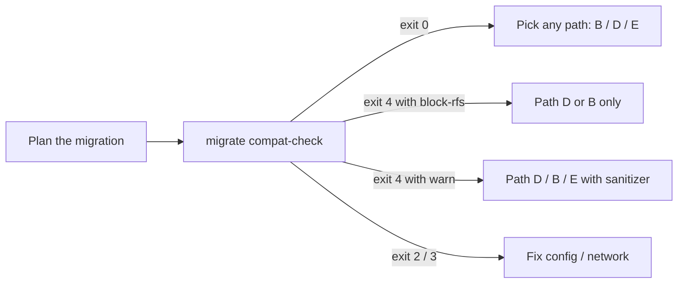

# Compatibility pre-flight (`compat_check.py`)

> Run this **before** you pick a migration path. It scans an OpenSearch
> (or Elasticsearch) source — and optionally the destination — and
> surfaces the per-cluster and per-index quirks that decide whether
> Path B (Logstash), Path D (S3 staging) or Path E (Reindex-from-Snapshot)
> will work cleanly.

`compat_check.py` is a **read-only** probe. It never writes, restores,
or mutates either cluster. Output is either a human report or a JSON
report (CI-friendly) plus strict exit codes.

## What it checks

| Layer | Check | Why it matters |
|-------|-------|----------------|
| **Cluster** | Source distribution + version + Lucene major | OS 1.x = Lucene 8, OS 2.x = Lucene 9, OS 3.x = Lucene 10. ES reads Lucene `N-1` and `N`, so OS 3.x cannot snapshot-restore into ES 8.x. |
| **Cluster** | Destination version + Lucene + `build_flavor` | Lets the tool detect Elastic Cloud Serverless automatically and emit the right warnings (forbidden settings, no snapshot restore). |
| **Index settings** | `index.knn` | k-NN indices use OpenSearch-specific vector segment formats. RFS cannot reconstruct them. Path D (S3 staging) + re-embedding works. |
| **Index settings** | `index.codec` (anything outside `default` / `best_compression`) | ZSTD / QAT codecs are OpenSearch-only. RFS may fail to read segments; Path D / B are unaffected. |
| **Index settings** | Serverless-forbidden prefixes (`index.number_of_*`, `index.refresh_interval`, `index.translog.*`, ...) | Surfaced when the destination is Serverless (auto-detected) or when you pass `--target-type ELASTICSEARCH_SERVERLESS`. The [`metadata_migration` sanitizer](../metadata_migration/) strips these automatically. |
| **Index mappings** | Legacy `string` type | ES 5/6 era. `metadata_migration` translates it to `text` + `keyword`. |
| **Index mappings** | Multi-type mappings (multiple top-level type names) | ES 5/6 era. Needs flattening to typeless before bulk load. |
| **Index mappings** | Deprecated options (`_all`, `_timestamp`, `_ttl`, `_size`, `_parent`, `include_in_all`) | Removed in ES 7+. Sanitizer drops them. |

The probe **does not**:

- exercise the data plane (no `_search`, no `_count`);
- pull cluster-wide stats that could load up a busy production source;
- attempt to coerce mappings — flagging is read-only.

## When to run it



Run it once at planning time and again whenever the source cluster
changes (new plugin enabled, new index created with k-NN, version
upgrade). It is fast — one `GET /`, one `GET /_cat/indices`, then
two GETs per index — so it is safe to wire into CI as a periodic check
against a staging mirror.

## Quick start

```bash
cp examples/env/compat-check.env.example .env
# Edit .env to set SOURCE_OPENSEARCH_HOST + DEST_ELASTIC_*.

# Human report.
migrate compat-check

# JSON report for CI, strict exit codes, all indices captured.
migrate compat-check \
  --report ./compat-report.json \
  --log-format json \
  --strict-exit-codes

# Scope the scan.
migrate compat-check \
  --include "logs-*" \
  --exclude "*-shadow" \
  --max-indices 500
```

Equivalent direct invocations: `python compat_check.py ...` or
`make compat-check ARGS="..."`.

## CLI flags

| Flag | Default | Notes |
|------|---------|-------|
| `--source-host` | `$SOURCE_OPENSEARCH_HOST` | Required. |
| `--source-user` / `--source-password` | env | Basic auth. If both unset, SigV4 is built from the AWS credential chain in `--source-region`. |
| `--source-region` | `$AWS_REGION` or `us-east-1` | Region used to sign SigV4 requests against AWS-managed OpenSearch. |
| `--dest-host` | `$DEST_ELASTIC_HOST` | **Optional.** When set, adds Lucene/Serverless cross-checks. |
| `--dest-api-key` / `--dest-user` / `--dest-password` | env | Either an API key or basic creds for the destination. |
| `--dest-api-key-encoded` | `false` | Set if you've pre-encoded the API key. |
| `--target-type` | inferred from `build_flavor` | `ELASTICSEARCH_SERVERLESS` forces the Serverless-forbidden settings check even without a live destination. |
| `--include` (repeatable) | none | fnmatch glob to include source indices. |
| `--exclude` (repeatable) | none | fnmatch glob to exclude source indices. |
| `--keep-system` | `false` | Include `.`-prefixed and Logstash/RFS bookkeeping indices. |
| `--max-indices` | `200` | Cap on indices inspected. |
| `--report` | `none` | Optional JSON report path. |
| `--log-format` | `text` | `text` for humans, `json` for CI. |
| `--strict-exit-codes` | `false` | Returns 0/2/3/4 (see below) instead of 0/1. |
| `--timeout-seconds` | `30` | HTTP timeout per request. |

## Severity levels

| Severity | Meaning |
|----------|---------|
| `ok` | No issues detected. Any path will work. |
| `warn` | Mappings or settings need sanitization (run `migrate metadata` first), but every data path remains usable. |
| `block-rfs` | RFS (Path E) cannot reconstruct this index because of k-NN or an OpenSearch-only codec. Use Path D (S3 staging) or Path B (Logstash). |
| `block-snapshot-restore` | Reserved for future use when we detect a Lucene gap too wide for the destination to read. |

## Exit codes (`--strict-exit-codes`)

| Code | Meaning |
|------|---------|
| `0` | Clean. Any data path (B / D / E) will work. |
| `2` | Misconfiguration — missing host/auth, unreadable filter, etc. |
| `3` | Transport / auth / TLS failure on source or destination. |
| `4` | Compatibility issues found. Document-streaming paths (B / D) still work; consult the per-index report before picking RFS. |

Without `--strict-exit-codes`, these collapse to `0` / `1` for legacy
scripts.

## Worked example output

```
Source: opensearch 2.13.0 (Lucene 9.10.0)
Dest:   elasticsearch 8.15.0 [serverless] (Lucene 9.10.0)

Cluster warnings:
  - Destination is Elastic Cloud Serverless. Run metadata_migration with
    --target-type ELASTICSEARCH_SERVERLESS before any data path; native
    snapshot restore not supported.

Indices: 4 scanned (ok=2, warn=1, block-rfs=1)

Index findings:
  [warn] orders-2024
      - 2 setting(s) forbidden on Serverless. metadata_migration sanitizer
        strips these automatically.
      settings: index.number_of_shards
      settings: index.refresh_interval
  [block-rfs] embeddings-2024
      - k-NN index. RFS cannot reconstruct OS k-NN vector segments. Use
        Path D (S3 staging) and re-embed on the destination.
      settings: index.knn=true

Recommendation:
  Use Path D (S3 staging) or Path B (Logstash). At least one index has
  features RFS cannot reconstruct.
```

## How it pairs with the rest of the toolkit

| When | Tool | Why |
|------|------|-----|
| **Before** picking a data path | `compat-check` (this tool) | Decide between B / D / E. |
| **Then** | `migrate metadata --target-type ...` | Pre-create destination indices with sanitized templates so bulk load doesn't trip on mapping mismatches. |
| **Then** | `migrate s3-extract` + `migrate s3-load` (or `migrate rfs`, or Logstash) | Move the data. |
| **Then** | `migrate validate` | Count + sample reconciliation. |
| **Then** | `migrate shadow-diff` | Query-parity gate before cutover. |
| **Optional** | `migrate replay` | Replay captured traffic to confirm production-shaped queries match. |

See [RUNBOOK.md](../RUNBOOK.md) for the end-to-end playbook and
[TOOLS.md](TOOLS.md) for the full CLI index.

## See also

- [METADATA_MIGRATION.md](METADATA_MIGRATION.md) — what the sanitizer
  actually rewrites.
- [SEMANTIC_MIGRATION.md](SEMANTIC_MIGRATION.md) — re-embedding k-NN
  indices on the destination.
- [RFS.md](RFS.md) — Reindex-from-Snapshot wrapper and where it has
  hard limits.
- [KAFKA_MIGRATION.md](KAFKA_MIGRATION.md) — document-level transform
  layer for Kafka-bridged migrations.
- [NETWORK_TOPOLOGY.md](NETWORK_TOPOLOGY.md) — which path is supported
  under your VPC / PrivateLink layout.
- [VERSION_MATRIX.md](VERSION_MATRIX.md) — Lucene window, OS/ES
  versions, and per-feature path matrix.
- [TROUBLESHOOTING.md](TROUBLESHOOTING.md) — common compat-related
  errors and their fixes.
