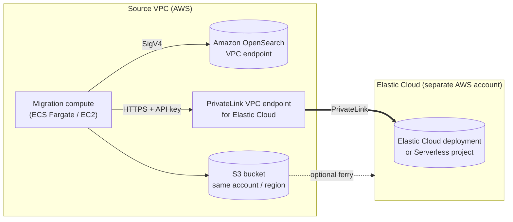
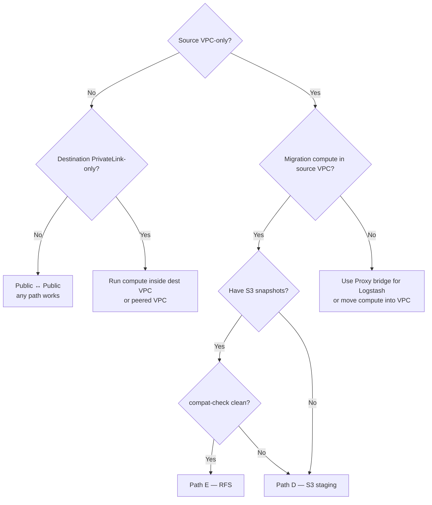

# Network topology guide

How each migration path in this repo behaves under each common network
topology, plus a decision flow for the most-asked scenarios:

- public source ↔ public destination (lab / sandbox);
- VPC-only source (Amazon OpenSearch in VPC mode) ↔ public destination;
- public source ↔ private destination (Elastic Cloud PrivateLink only);
- **VPC-only source ↔ private destination** (the most common production
  enterprise topology — and the one the [SigV4 Proxy](../Proxy/README.md)
  was designed for);
- air-gapped source (no IP path between source and destination at all).

If you only read one thing, jump to the
[**Topology × path matrix**](#topology--path-matrix) and the
[**Recommended pattern**](#recommended-pattern-vpc-only-source--privatelink-destination)
for the enterprise case.

## Why topology drives path selection

The six data paths in this repo move documents very differently:

| Path | Who initiates network traffic | Direction of the long-lived connection |
|------|-------------------------------|-----------------------------------------|
| **A. Remote reindex** | Elastic Cloud → OpenSearch (scroll/PIT) | **Dest → Source** |
| **B. Logstash** | Logstash host → both | Compute → both |
| **C. Kafka (architectural)** | Producer → broker → consumer | Compute → broker → both |
| **D. S3 staging** | Extractor → OpenSearch + S3; Loader → S3 + Elastic | Compute → both, with **S3 in the middle** |
| **E. RFS (wrapped)** | RFS container → S3 + Elastic | Compute → S3 + Elastic (**reads source via snapshot, not REST**) |
| **F. Capture & replay** | Proxy / replayer → both | Compute → both |

That difference matters because **only Path A requires the destination
to reach the source**. Every other path lets *you* control where the
compute sits and which direction traffic flows. In a typical enterprise
"OpenSearch in our VPC + Elastic Cloud behind PrivateLink" setup, Path A
is usually impossible without extra plumbing, while Paths D and E are a
natural fit.

## Topology × path matrix

| Topology | A. Remote reindex | B. Logstash | C. Kafka | D. S3 staging | E. RFS | F. Capture / replay |
|---------|:-----------------:|:-----------:|:--------:|:-------------:|:------:|:-------------------:|
| Public ↔ Public | ✅ | ✅ | ✅ | ✅ | ✅ | ✅ |
| VPC source ↔ Public dest | ⚠️ via Proxy[^1] | ✅ via Proxy or in-VPC | ✅ | ✅ | ✅ | ✅ |
| Public source ↔ PrivateLink dest | ❌ unless source can hit VPC endpoint | ✅ from inside the dest VPC | ✅ | ✅ | ✅ | ✅ |
| **VPC source ↔ PrivateLink dest** | ❌ | ✅ in-VPC[^2] | ✅ | ✅ recommended | ✅ recommended | ✅ |
| Air-gapped source (no IP path) | ❌ | ❌ | ❌ | ✅ via S3 ferry[^3] | ✅ via S3 ferry | ❌ |

[^1]: The Proxy makes Elastic Cloud's outbound IPs hit a public
      `https://` URL that signs to the OpenSearch VPC endpoint. It works
      but is only practical when the destination is Elastic Cloud
      Hosted (Serverless doesn't support remote reindex at all). See
      [docs/SERVERLESS.md](SERVERLESS.md).

[^2]: The Logstash worker must run inside the source VPC so it can both
      read from OpenSearch directly and resolve the Elastic Cloud
      PrivateLink endpoint. Put it on EC2 / ECS / Fargate inside that VPC.

[^3]: "S3 ferry" = extract on a host that can reach the source, copy the
      S3 prefix into a bucket the destination network can read
      (cross-account replication, manual `aws s3 sync`, AWS Transfer
      Family, etc.), then load from there. See
      [docs/S3_MIGRATION.md](S3_MIGRATION.md#air-gapped-source).

Legend: ✅ supported, ⚠️ supported with extra plumbing, ❌ not viable.

## Where the Proxy fits

The [SigV4 reverse proxy](../Proxy/README.md) is **only useful when
something outside your VPC needs to talk to a VPC-only OpenSearch
domain** — usually Elastic Cloud Hosted doing a remote `_reindex`, or
Logstash running outside the source VPC.

You **do not** need the Proxy if:

- The migration compute (Logstash, S3 extract worker, RFS container)
  runs inside the source VPC. It can hit the OpenSearch VPC endpoint
  directly with SigV4 from `boto3` / `requests_aws4auth`.
- You are using Path D, E, or F entirely from inside the source VPC.
  These compute paths only need outbound access to S3 and the Elastic
  Cloud PrivateLink endpoint, never inbound to OpenSearch.
- The source is **not** in a VPC (public Amazon OpenSearch endpoint,
  self-hosted OpenSearch reachable directly, etc.).

The Proxy is also where the optional
[capture mode](CAPTURE_REPLAY.md) lives, so you may run it for capture
even when you don't need it for VPC bridging.

## Recommended pattern: VPC-only source + PrivateLink destination

This is the most common enterprise topology and the one most users ask
about. Here is the supported pattern:

**Components:**

| Component | Where it runs | What it does |
|-----------|---------------|--------------|
| Migration compute | ECS Fargate or EC2 inside the source VPC | Runs `migrate compat-check`, `migrate metadata`, `migrate s3-extract`, `migrate s3-load`, `migrate validate`, etc. The Terraform module at [`iac/terraform/rfs-fargate`](../iac/terraform/rfs-fargate/) provisions one option. |
| S3 bucket | Same account + region as the source VPC | Staging for Path D / E. Reach via VPC gateway endpoint (no NAT). |
| PrivateLink endpoint | Source VPC | Created by Elastic Cloud's PrivateLink integration. The Elastic Cloud DNS name resolves only to this private IP from inside the VPC. |
| (Optional) Route 53 PHZ | Source VPC | Some deployments need a private hosted zone so `*.es.region.aws.found.io` resolves to the VPC endpoint. Documented in [docs/ORG_PRODUCTION_IAC.md](ORG_PRODUCTION_IAC.md). |
| (Optional) SigV4 Proxy | Not in this topology | Only needed if Elastic Cloud itself must reach the source (Path A). Skip it. |

### Which paths to use, in order

1. **Always:** `migrate compat-check` from the source VPC — verifies
   the source can be probed and writes a per-index compatibility report
   ([COMPAT_CHECK.md](COMPAT_CHECK.md)).
2. **Always:** `migrate metadata` — pre-creates destination indices /
   templates / ingest pipelines with sanitization
   ([METADATA_MIGRATION.md](METADATA_MIGRATION.md)).
3. **Pick one primary path:**
   - **Path D (S3 staging)** if you do not already have snapshots, want
     a resumable pipeline, or hit k-NN / OS-only codec warnings from
     compat-check. See [S3_MIGRATION.md](S3_MIGRATION.md).
   - **Path E (RFS)** if you already have S3 snapshots and compat-check
     came back clean (no `block-rfs` indices). See [RFS.md](RFS.md).
   - **Path B (Logstash)** for streaming or when you want filter logic in
     the pipeline. Run Logstash inside the source VPC; it will reach the
     OpenSearch endpoint directly and the Elastic Cloud PrivateLink
     endpoint via DNS. See [Logstash_input/README.md](../Logstash_input/README.md).
4. **Always:** `migrate validate` — count + sampled `_mget` parity.
5. **Recommended cutover gates:** `migrate shadow-diff` ±
   `migrate replay` ([SHADOW_DIFF.md](SHADOW_DIFF.md),
   [CAPTURE_REPLAY.md](CAPTURE_REPLAY.md)).

### What you do **not** need

- **A SigV4 Proxy.** Migration compute lives inside the source VPC and
  reaches OpenSearch directly. The Proxy exists for the *inverse* case
  (something outside the VPC needing to call OpenSearch).
- **A NAT gateway** for migration traffic. S3 via gateway VPC endpoint;
  Elastic Cloud via PrivateLink interface endpoint. Both are private.
- **Public IPs on migration tasks.** Fargate awsvpc with private subnets
  is fine.

### What you *do* need

- An IAM role on the migration compute with:
  - `es:ESHttp*` on the source OpenSearch domain;
  - `s3:GetObject` / `s3:PutObject` / `s3:ListBucket` on the staging
    bucket;
  - (For RFS) the snapshot bucket and the snapshot KMS key, if any.
- A Secrets Manager secret (or equivalent) for `DEST_ELASTIC_API_KEY` —
  do not bake it into images or env files.
- DNS resolution for the Elastic Cloud PrivateLink endpoint inside the
  source VPC. AWS console: VPC → Endpoints → confirm the endpoint
  service is **accepted** and **private DNS** is enabled. Otherwise add
  a Route 53 private hosted zone.

## Other topologies

### Public source ↔ public destination

Lab / sandbox setup. Anything works. Useful for shaking down the
toolkit before pointing it at production. Common pitfalls: not setting
`SOURCE_OPENSEARCH_USER`/`PASSWORD` (the tool falls back to SigV4 and
fails on a non-AWS source — pass `--source-user`/`--source-password`).

### VPC-only source ↔ public destination

Same compute pattern as the enterprise case: migration compute inside
the source VPC, Elastic Cloud reachable through normal egress. Skip
PrivateLink. Path A (remote reindex) still requires the Proxy because
*Elastic Cloud* must reach the OpenSearch VPC endpoint.

### Public source ↔ PrivateLink destination

Run migration compute in a network that can resolve and reach the
PrivateLink endpoint (typically the VPC where the endpoint lives, or a
peered VPC). It reads the public source directly and writes via the
private endpoint. Path D / E / B / F all work cleanly; A only works if
the source is also reachable from the destination's network.

### Air-gapped source

If there is **no IP path** between the source and destination networks
— for example, OpenSearch in a private data centre with no outbound
internet — fall back to S3 ferry:

1. Extract on a host that can reach the source (`migrate s3-extract` →
   local-S3-compatible store, or `--manifest-only` to write to a tape /
   sneakernet medium).
2. Move the bytes across the gap.
3. Load on a host that can reach the destination (`migrate s3-load`).

This is the only zero-IP-path migration this toolkit supports. Logstash,
Kafka, remote reindex and the Proxy all require an IP-level path.

## Decision flow

## See also

- [COMPAT_CHECK.md](COMPAT_CHECK.md) — what to check before picking a
  path.
- [Proxy/README.md](../Proxy/README.md) — when the SigV4 proxy is
  actually needed.
- [S3_MIGRATION.md](S3_MIGRATION.md) — the most networking-flexible
  path.
- [RFS.md](RFS.md) — snapshot-based path; needs read access to the
  snapshot bucket from the migration compute.
- [SERVERLESS.md](SERVERLESS.md) — Elastic Cloud Serverless specifics
  (no remote reindex, no native snapshot restore).
- [iac/terraform/rfs-fargate](../iac/terraform/rfs-fargate/) and
  [iac/terraform/rfs-orchestration](../iac/terraform/rfs-orchestration/)
  — reference Terraform for running migration compute in-VPC.
- [docs/ORG_PRODUCTION_IAC.md](ORG_PRODUCTION_IAC.md) — Route 53 PHZ
  and other org-level networking concerns.
