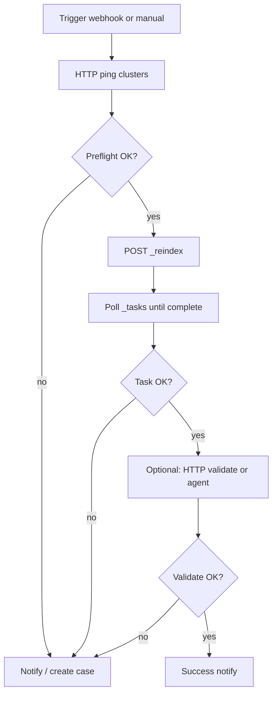

# Tines story template: OpenSearch → Elastic migration

Use this document as a **blueprint** you **recreate in the Tines UI**: add actions, attach **Credentials** (API keys, basic auth), set **team or global variables** for base URLs and other non-secret config, then **run** the story from Tines via manual test, **webhook**, or **schedule**. Nothing in this repo substitutes for Tines’ credential store—you do not paste production secrets into git.

This repo’s root **`.env`** is for running **Python CLIs** locally or on a runner; in Tines you use **their** credentials and variables instead.

Tines terminology: **Story** = workflow; **Action** = step; **Credential** = stored secret or HTTP auth config; **Pill** = formula referencing event data or credentials (build pills in the Tines **formula editor**—see [HTTP Request action](https://www.tines.com/docs/actions/types/http-request/) and [Credentials](https://www.tines.com/docs/credentials/)).

**Related:** CLI tools and exit codes in [AUTOMATION.md](AUTOMATION.md); platform comparison in [ORCHESTRATION.md](ORCHESTRATION.md).

---

## Prerequisites in Tines

1. **Team** with permission to create stories and credentials.
2. **Credentials** (create before wiring HTTP actions):

   | Suggested name | Type | Use |
   |----------------|------|-----|
   | `Elastic Cloud API` | API key / Bearer or custom header | `Authorization: ApiKey <key>` to your Elasticsearch URL |
   | `OpenSearch basic auth` | Username + password | Amazon OpenSearch fine-grained user, or proxy basic auth |
   | *(optional)* `Elastic basic` | Username + password | If you do not use API keys |

3. **Global resource or team variables** (optional): `ELASTIC_BASE_URL`, `OPENSEARCH_BASE_URL` (no trailing path), e.g. `https://my-deployment.es.region.aws.found.io` and `https://search-....es.amazonaws.com`.

4. **Trigger:** choose one:
   - **Webhook** — programmatic start from CI or a portal (POST JSON body with index names).
   - **Manual test** — “Send test event” with sample JSON while building.
   - **Schedule** — only if migrations are time-windowed and idempotent.

---

## Story overview (recommended phases)



**Simpler variant:** Trigger → **Webhook to your runner** that executes `make preflight && … && make validate` and returns JSON (single HTTP action + branches on status code).

---

## Sample trigger payload (webhook)

Document this contract for callers:

```json
{
  "source_index": "logs-2024",
  "dest_index": "logs-2024",
  "run_reindex": true,
  "reindex_body": null
}
```

- If `reindex_body` is `null`, your story can **Event Transform** to assemble the default `source.remote` body, or require operators to paste a template from this repo’s `Remote_Reindex/` JSON.
- `run_reindex: false` — only preflight + validate (useful after an external sync).

---

## Action-by-action blueprint

Numbering is logical; rename actions for your style guide.

### 1. Event Transformation (optional) — normalize input

- **Purpose:** Default missing fields, validate required keys (`source_index`, `dest_index`).
- **On missing field:** route to a **Send to Story** / **Email** action with a clear error (fail fast).

### 2. HTTP Request — Preflight Elasticsearch

- **Method:** `GET`
- **URL:** `{{ ELASTIC_BASE_URL }}/` (or full URL from credential + formula).
- **Credential / headers:** Elastic API key (or basic).
- **Success:** 2xx JSON with cluster info.
- **Failure branch:** Treat 4xx/5xx or connection error → **Notify** path (retry only if you classify as transient).

### 3. HTTP Request — Preflight OpenSearch

- **Method:** `GET`
- **URL:** `{{ OPENSEARCH_BASE_URL }}/`
- **Credential:** OpenSearch basic auth or SigV4-compatible path (if you terminate at a **Proxy**, use proxy basic auth).
- **Note:** SigV4 from Tines natively may require an intermediate **Lambda** or **Proxy**; many teams use the repo [Proxy](../Proxy/README.md) and basic auth from Tines.

### 4. HTTP Request — Optional index existence

- **Method:** `HEAD`
- **URL:** `{{ OPENSEARCH_BASE_OUT }}/{{ source_index }}` (construct with formula from trigger payload).
- **Repeat** for destination index on Elastic if needed.

### 5. HTTP Request — Start reindex (Elastic Hosted only)

- **Method:** `POST`
- **URL:** `{{ ELASTIC_BASE_URL }}/_reindex?wait_for_completion=false&pretty`
- **Headers:** `Content-Type: application/json`, plus auth.
- **Body** (example — replace remote host and credentials to match your allowlist):

```json
{
  "source": {
    "remote": {
      "host": "https://search-your-domain.region.es.amazonaws.com:443",
      "username": "migration_user",
      "password": "USE_TINES_SECRET_OR_CREDENTIAL"
    },
    "index": "REPLACE_WITH_FORMULA_FROM_TRIGGER_EVENT"
  },
  "dest": {
    "index": "REPLACE_WITH_FORMULA_FROM_TRIGGER_EVENT"
  }
}
```

In the Tines UI, replace the placeholder index strings with **pills** (formula builder) that read `source_index` and `dest_index` from your trigger payload. Do not paste real passwords into the story JSON—use **Credentials**.

- **Parse response:** read `task` id from the JSON (string like `node_id:task_id`). Store on the event for the next actions (Event Transformation extracting `$.task`).

**Serverless destination:** skip this action; use a different story that drives **Logstash/Kafka** or a **runner**—remote `_reindex` is not supported (see [SERVERLESS.md](SERVERLESS.md)).

### 6. Event Transformation — extract `task_id`

- **Purpose:** Normalize `task` field (strip `task:` prefix if present) for polling.

### 7. Repeat / Delay / Loop — Poll `_tasks`

Tines patterns vary (e.g. **Repeat n times** with **Delay**, or **Send to Self** with a counter). Minimal contract:

- **Method:** `GET`
- **URL:** `{{ ELASTIC_BASE_URL }}/_tasks/{{ task_id }}`
- **Until:** `completed == true` or timeout.
- **Delay:** 5–15 seconds between polls for large jobs.

On completion, body may contain `error` or `response.failures`. Branch:

- If `error` or failures array non-empty → **Notify failure** with payload excerpt.
- Else → proceed to validation.

### 8. Validation options (pick one)

**A. Delegate to your runner (recommended for parity with this repo)**

- Single **HTTP Request** to an internal service or **Tines Agent** that runs:

  ```bash
  python validate_migration.py --strict-exit-codes --output-format json \
    --source-index "..." --dest-index "..."
  ```

- Map **HTTP status** or JSON `summary.failed` to branches. Align with [AUTOMATION.md](AUTOMATION.md) exit codes if you invoke the script directly from an agent.

**B. Pure Tines**

- **GET** `{{ OPENSEARCH_BASE }}/{{ source_index }}/_count`
- **GET** `{{ ELASTIC_BASE }}/{{ dest_index }}/_count`
- **Event Transformation** to compare `count` fields; mismatch → notify.

Add optional `_search` + `_mget` sampling later if you need stronger checks than counts.

### 9. Send Email / Slack / CASE

- **Success:** include index names, task timings, doc counts.
- **Failure:** include last HTTP response snippet, link to Tines run, **no secrets**.

---

## Branching and retries (align with strict exit codes)

If you call an external runner that uses this repo’s scripts with **`--strict-exit-codes`**:

| Exit code | Meaning | Tines handling |
|-----------|---------|----------------|
| 0 | Success | Continue / notify OK |
| 1 | Validation / data | **Do not** blind retry; open ticket |
| 2 | Credentials / usage | Fix config, alert platform team |
| 3 | Network / HTTP | **Retry** with backoff (cap attempts) |

---

## After you build it

1. **Test** with a tiny index and Manual send event.
2. **Export** the story from Tines (UI: Export story) and archive in your org’s git **without** embedding production secrets.
3. **Document** which **Team** owns the story and who may trigger the webhook.

## Import JSON

Tines **import** expects the JSON produced by **Export story** in the same product version. This repository does not ship that JSON because it would reference invalid credential IDs and team slugs in your workspace. Build once from this template, then export for your internal reuse.
